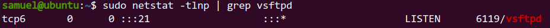
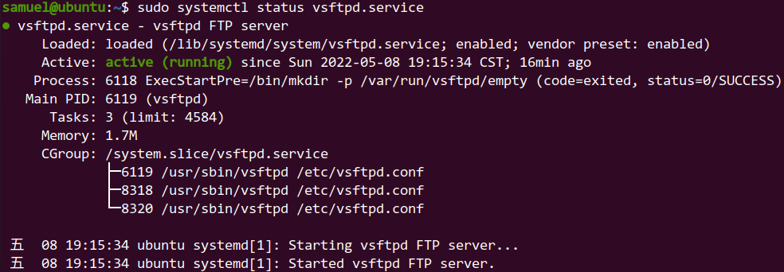
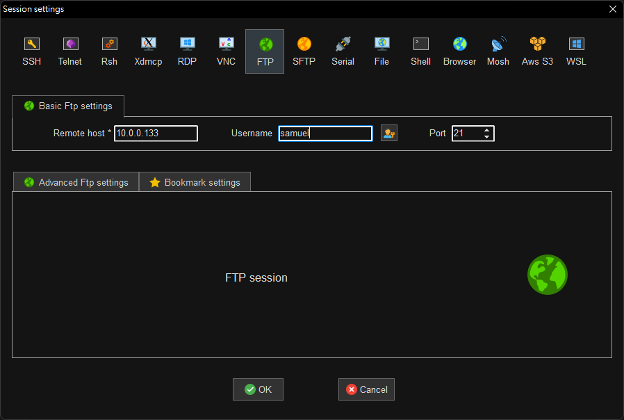
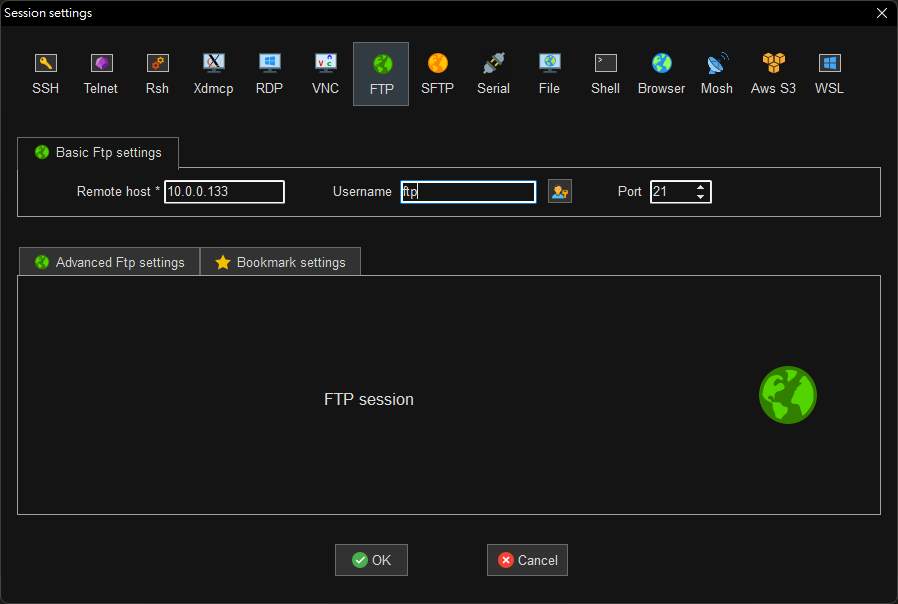

# FTP 伺服器架設

<!-- vim-markdown-toc GFM -->

* [FTP 的資料連結原理](#ftp-的資料連結原理)
* [FTP 模式](#ftp-模式)
* [安裝簡易型 FTP 伺服器](#安裝簡易型-ftp-伺服器)
* [修改設定檔允許本機用戶登入](#修改設定檔允許本機用戶登入)
* [更改匿名使用者目錄權限](#更改匿名使用者目錄權限)
  - [關閉寫入權限](#關閉寫入權限)
  - [更改使用者](#更改使用者)
  - [創見上傳目錄](#創見上傳目錄)
  - [更改上傳目錄權限](#更改上傳目錄權限)
  - [更改上傳目錄使用者](#更改上傳目錄使用者)
* [重起 FTP 服務](#重起-ftp-服務)
* [防火牆設置](#防火牆設置)
* [使用 MobaXterm 連接](#使用-mobaxterm-連接)
  - [普通使用者連接](#普通使用者連接)
  - [匿名用戶連接](#匿名用戶連接)
* [參考資料](#參考資料)

<!-- vim-markdown-toc -->

## FTP 的資料連結原理
檔案傳輸協定（英語：File Transfer Protocol，縮寫：FTP）是一個用於在電腦網路上在客戶端和伺服器之間進行檔案傳輸的應用層協定。檔案傳送（file transfer）和檔案存取（file access）之間的區別在於：前者由FTP提供，後者由如NFS等應用系統提供。

FTP是一個8位元的客戶端-伺服器協定，能操作任何類型的檔案而不需要進一步處理，就像MIME或Unicode一樣。但是，FTP有著極高的延時，這意味著，從開始請求到第一次接收需求資料之間的時間，會非常長；並且不時的必須執行一些冗長的登入行程。

## FTP 模式

- 主動模式：在主動模式下，伺服器會主動核准資料請求。不過，主動模式有時可能會因防火牆而發生問題，即防火牆會封鎖來自第三方未經授權的工作階段。

- 被動模式：伺服器不會主動維持連線，而是由使用者同時建立資料通道和命令通道。基本上，伺服器「聽令」但不主動參與，而是由其他裝置來處理大部分工作。

## 安裝簡易型 FTP 伺服器

- 安裝

```shell
sudo apt install vsftpd -y
```

- 確認端口狀態

```
sudo netstat -tlnp | grep vsftpd
```

 

- 確認服務狀態

```
sudo systemctl status vsftpd.service
```

 

## 修改設定檔允許本機用戶登入

```shell
sudo vim /etc/vsftpd.conf
```

```properties
# 開啟寫入權限
write_enable=yes
# 允許本機用戶登入
local_enable=YES
# 設定允許使用者可以上傳檔案與目錄
write_enable=YES
# 本地用戶上傳文件的umask
local_umask=022
# 啟用上傳/下載日誌紀錄
xferlog_enable=YES
# 日誌紀錄使用標準xferlog格式
xferlog_std_format=YES
# 默認權限掩碼
local_umask=022
# 允許匿名使用者
anonymous_enable=YES
no_anon_password=YES
# 設定匿名使用者根目錄
anon_root=/var/ftp
# 允許上傳
anon_upload_enable=YES
# 允許寫入創見目錄
anon_mkdir_write_enable=YES
anon_other_write_enable=YES
```

## 更改匿名使用者目錄權限

### 關閉寫入權限

```shell
sudo chmod a-w /var/ftp/
```

### 更改使用者

```shell
sudo chown ftp:ftp /var/ftp/
```

### 創見上傳目錄

```shell
sudo mkdir /var/ftp/upload/
```

### 更改上傳目錄權限

```shell
sudo chmod 777 /var/ftp/upload/
```

### 更改上傳目錄使用者

```shell
sudo chown ftp:ftp /var/ftp/upload/
```

## 重起 FTP 服務

```shell
sudo /etc/init.d/vsftpd restart
```

或

```shell
sudo systemctl restart vsftpd.service
```

## 防火牆設置

```shell
sudo ufw allow from any to any port 20,21,10000:10100 proto tcp
sudo ufw reload
```

## 使用 MobaXterm 連接

### 普通使用者連接

 

- 連線成功

 

### 匿名用戶連接

 

- 連線成功

 

## 參考資料

[Wiki FTP](https://zh.wikipedia.org/zh-tw/%E6%96%87%E4%BB%B6%E4%BC%A0%E8%BE%93%E5%8D%8F%E8%AE%AE) 

[Ubuntu FTP server 架設](https://www.alvinchen.club/2019/12/11/ubuntu-ftp-server-%E6%9E%B6%E8%A8%AD/) 

[ubuntu 安裝 ftp 與設定權限](https://oranwind.org/-ftp-ubuntu-an-zhuang-ftp-yu-she-ding-apache-du-qu-quan-xian/) 

[使用Ubuntu Server架設FTP伺服器](https://magiclen.org/ubuntu-server-vsftpd/) 

