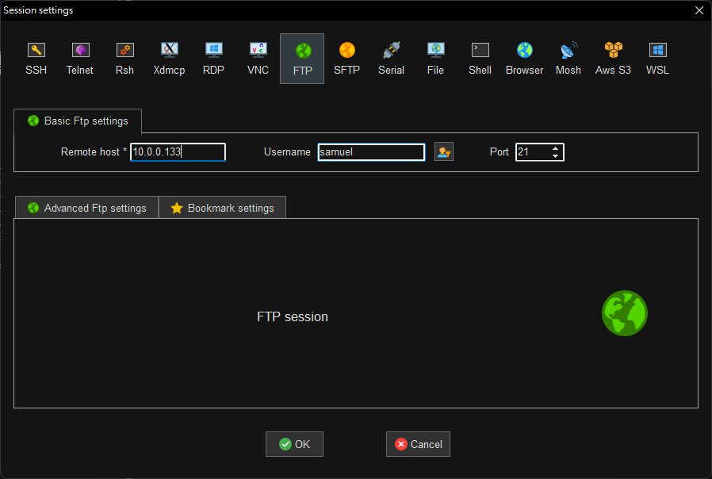

# FTP 伺服器架設

## 安裝簡易型 FTP 伺服器

```shell
sudo apt install vsftpd -y
```
## 修改設定檔允許本機用戶登入

```shell
sudo vim /etc/vsftpd.conf
```

```properties
#允許本機用戶登入
local_enable=YES
#設定允許使用者可以上傳檔案與資料夾
write_enable=YES
#本地用戶上傳文件的umask
local_umask=022
#啟用上傳/下載日誌紀錄
xferlog_enable=YES
#日誌紀錄使用標準xferlog格式
xferlog_std_format=YES
```

## 重起 FTP 服務

```shell
sudo /etc/init.d/vsftpd restart
```

## 使用 MobaXterm 連接

 
